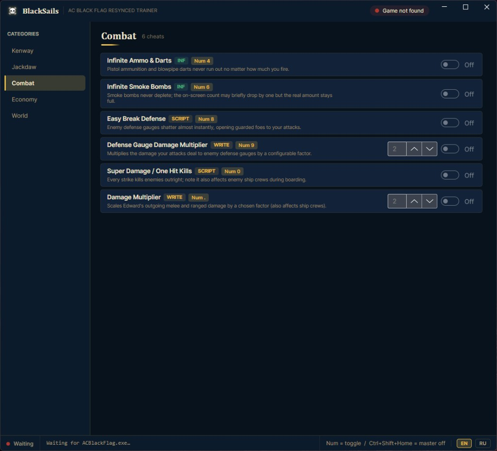

# Assassin's Creed IV Black Flag — ACBFResynced
### God Mode · Money · Teleport · Jackdaw · One Hit

**Languages / Языки:** [Русский](README.md) · [English](README.en.md) · [Українська](README.uk.md) · [简体中文](README.zh.md) · [Türkçe](README.tr.md) · [Español](README.es.md) · [Slovenščina](README.sl.md) · [Português](README.pt.md) · [Polski](README.pl.md) · [Indonesia](README.id.md) · [Deutsch](README.de.md) · [Français](README.fr.md)

Trainer para **Assassin's Creed IV: Black Flag (ACBFResynced / remake)**.  
God Mode, HP infinito, reales, Jackdaw, teletransporte, one-hit y más.

  

  
  &nbsp;
  
  &nbsp;
  

  
  
  
  

---

## Descargar

> Enlace directo al ZIP del release:

**→ [Descargar AC.Black.Flag.Resynced.BlackSails.Trainer.zip](https://github.com/TrainerHubMoggyDay/Assassins-Creed-Black-Flag-Resynced-GodMode-Money-Jackdaw-Teleport/releases/download/v1.0.0/AC.Black.Flag.Resynced.BlackSails.Trainer.zip)**

También en **VGtimes**:  
**→ [Publicación en VGtimes — Assassin's Creed Black Flag Resynced](https://vgtimes.ru/games/assassins-creed-black-flag-resynced/files/96329-assassins-creed-black-flag-resynced.html)**

Después de descargar: inicia el juego → inicia el trainer → espera `ACBlackFlag.exe` → activa funciones.

---

## Vídeo — prueba de funciones

Demo completa en YouTube:

**→ [https://youtu.be/UqLrj-KyjLs](https://youtu.be/UqLrj-KyjLs)**

  

---

## Capturas

  
  &nbsp;
  

  
  &nbsp;
  

---

## Funciones

### Kenway
- God Mode / Ignore Hits
- Infinite Health
- Infinite Oxygen
- Infinite Remedy
- Stealth Mode
- Defense Multiplier
- Oxygen Drain Rate

### Jackdaw
- Ship: Infinite Health
- Ship: Infinite Crews
- Ship: Infinite Ammo
- Ship: Instant Weapon Cooldown
- Ship: Super Damage / One Hit Kills
- Ship: Damage Multiplier
- Ship: Defense Multiplier

### Combat
- Infinite Ammo & Darts
- Infinite Smoke Bombs
- Easy Break Defense
- Defense Gauge Damage Multiplier
- Super Damage / One Hit Kills
- Damage Multiplier

### Economy
- Add Money (reales)
- Money Multiplier
- Edit Selected Item Amount

### World
- Clear Wanted Level
- Freeze Time of Day
- Daytime +1 Hour
- Set Game Speed
- Save Location
- Teleport to Saved Location
- Teleport to Marker Location

---

## Cómo usar

1. Inicia **Assassin's Creed IV Black Flag** (build **ACBFResynced**)
2. Inicia el trainer
3. Espera la conexión a `ACBlackFlag.exe`
4. Elige categoría: Kenway / Jackdaw / Combat / Economy / World
5. Activa con **NumPad** o interruptores
6. Idioma UI: **EN** / **RU**

| Tecla | Acción |
|---------|----------|
| `Num …` | Activar / desactivar |
| `Ctrl + Shift + Home` | Master Off |

---

## Enlaces

- **ZIP:** [AC.Black.Flag.Resynced.BlackSails.Trainer.zip](https://github.com/TrainerHubMoggyDay/Assassins-Creed-Black-Flag-Resynced-GodMode-Money-Jackdaw-Teleport/releases/download/v1.0.0/AC.Black.Flag.Resynced.BlackSails.Trainer.zip)
- **VGtimes:** [https://vgtimes.ru/games/assassins-creed-black-flag-resynced/files/96329-assassins-creed-black-flag-resynced.html](https://vgtimes.ru/games/assassins-creed-black-flag-resynced/files/96329-assassins-creed-black-flag-resynced.html)
- **YouTube:** [https://youtu.be/UqLrj-KyjLs](https://youtu.be/UqLrj-KyjLs)
- **Repo:** [https://github.com/TrainerHubMoggyDay/Assassins-Creed-Black-Flag-Resynced-GodMode-Money-Jackdaw-Teleport](https://github.com/TrainerHubMoggyDay/Assassins-Creed-Black-Flag-Resynced-GodMode-Money-Jackdaw-Teleport)
- **Org:** [https://github.com/TrainerHubMoggyDay](https://github.com/TrainerHubMoggyDay)

---

## Versión compatible

| | |
|--|--|
| Juego | Assassin's Creed IV: Black Flag |
| Build | ACBFResynced |
| Proceso | `ACBlackFlag.exe` |
| SO | Windows 10 / 11 |
| Idioma | EN + RU |

---

## FAQ

**¿Dónde descargar?**  
Botón verde o [ZIP directo](https://github.com/TrainerHubMoggyDay/Assassins-Creed-Black-Flag-Resynced-GodMode-Money-Jackdaw-Teleport/releases/download/v1.0.0/AC.Black.Flag.Resynced.BlackSails.Trainer.zip). También [VGtimes](https://vgtimes.ru/games/assassins-creed-black-flag-resynced/files/96329-assassins-creed-black-flag-resynced.html).

**¿God Mode / dinero / teletransporte / Jackdaw?**  
Sí — mira funciones y el vídeo.

**¿Interfaz en ruso?**  
Sí — interruptor **RU** abajo.

---

## Aviso legal

Solo un jugador. El autor y [TrainerHub MoggyDay](https://github.com/TrainerHubMoggyDay) no se responsabilizan. No uses online / multijugador.

---

  

  ACBFResynced · Assassin's Creed IV Black Flag · <a href="https://github.com/TrainerHubMoggyDay">TrainerHub MoggyDay</a>

